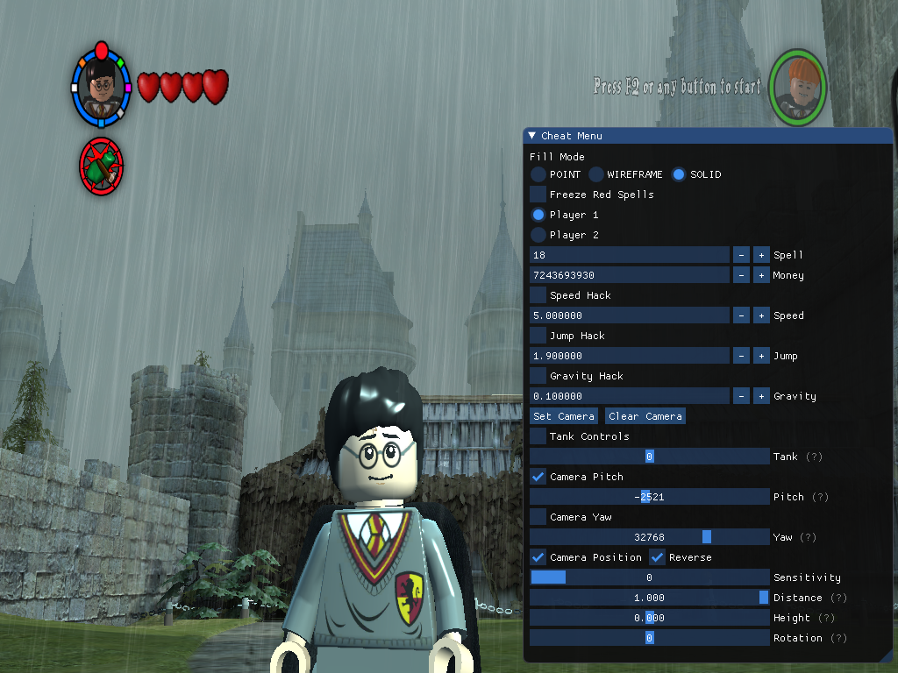
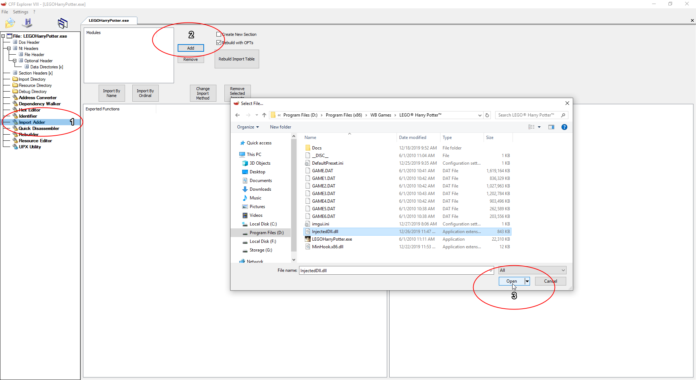
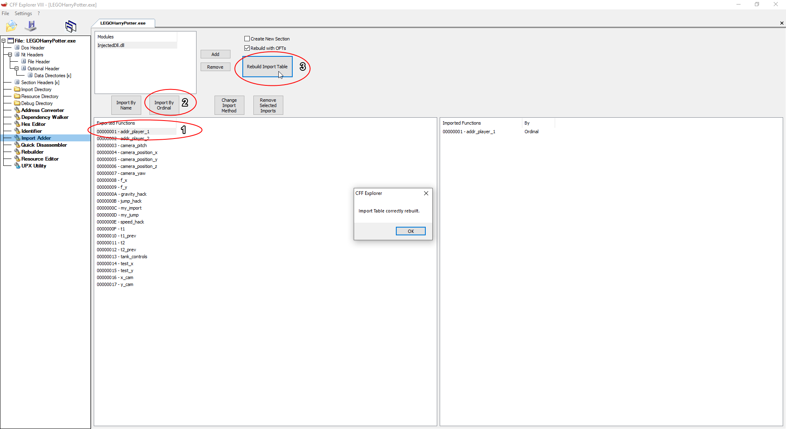
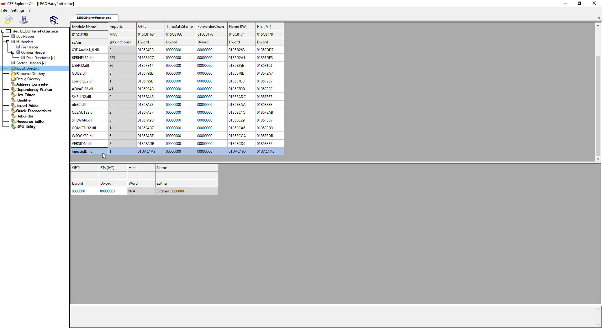
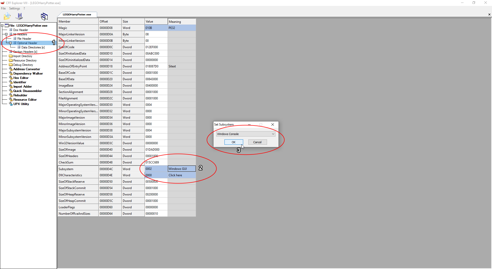

# Lego Harry Potter: Years 1-4 Mod

## Description

Variety of game modifications for Lego Harry Potter Years 1-4 including simple data manipulation, custom gravity, a first-person camera, and altering render states.

## Technologies

[Cheat Engine](https://www.cheatengine.org/), Assembly, C/C++, [Kiero](https://github.com/Rebzzel/kiero), [Dear ImGui](https://github.com/ocornut/imgui), [MinHook](https://github.com/TsudaKageyu/minhook)

## Demo

https://youtu.be/IAHii096mQw

## Build with MSVC

**Requirements**

* Windows SDK
* Microsoft Build Tools

**Instructions**

1. Edit **build.cmd**

    * set path variable ***vcvars32*** to where your copy is located
    * set path variable ***game_directory*** to your game's directory

2. Run **build.cmd** (When a build is successful, **InjectedDll.dll** and **MinHook.x86.dll** are automatically copied to game's directory)

## Build with Docker

* Run from Command Prompt
* Make sure following option is correct path for your installation
`-v "D:\Program Files (x86)\WB Games\LEGO® Harry Potter™":/output` 
* Add following option if you want to mount current directory to build from
`-v "%cd%":/build`
* Append `bash` to end of command and run `make install` to build from shell

### Build using files already in Docker container

`docker run -it --rm -v "D:\Program Files (x86)\WB Games\LEGO® Harry Potter™":/output mjbelow/lego-harry-potter-years-1-4-mod`

## Usage

Output of build is **InjectedDLL.dll**, which needs to be injected into the game's executable.

There are many tools for injecting dll's, but I prefer to modify the executable itself so you don't have to inject it each time you play. The tool that I will be using is [CFF Explorer](https://ntcore.com/?page_id=388)

1. Backup original game executable (LEGOHarryPotter.exe.bak)
2. Adding **InjectedDLL.dll**

3. Just need to choose 1 function to be imported (doesn't matter which one)

4. **InjectedDLL.dll** should now be in the Import Directory

5. If you want to show a console when you run the game (for debugging purposes or other reasons)

6. Remember to save the new executable (LEGOHarryPotter.exe)

Now when you run the game, InjectedDLL.dll and MinHook.x86.dll will be injected into the process (so they must be in the same directory as the executable), and you can then activate the **Cheat Menu** by pressing *Shift*.
